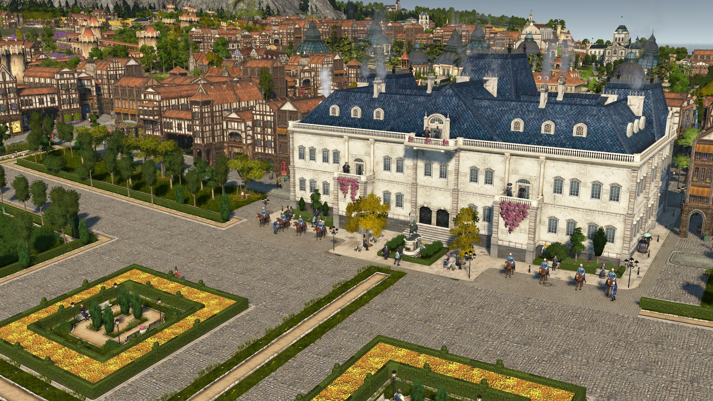

# - Latest Release -

> A complete Game Overhaul to enhance game depth and balancing.

- &#x2022; New Mars Sector
- &#x2022; New Arctic Tier 3 population
- &#x2022; Complete overhaul of all production chains
- &#x2022; 9 new goods and several existing ones reworked
- &#x2022; Enhanced game depth, complexity and region interaction
- &#x2022; Intense Rework of the Orbital Station and Technology Nexus

[Learn more](/en/Anno2205/Anno2205NewFrontiers.md)
[Download Release](https://github.com/Taludas/Anno2205-NewFrontiers/releases/latest/download/Anno2205_NewFrontiers.zip)

<!-- background image -->

