## Überarbeitete und neue Produktionsketten
In der Reihenfolge ihres Auftauchens:
  - ###  Vitamin-Drinks:

    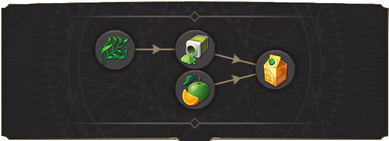

    Für Vitamingetränke werden nun Algen benötigt, die zunächst zu Nährstoffpulver verarbeitet werden. Es handelt sich um ein Mehrregionenprodukt, da alle Regionen außer dem Mond die Möglichkeit haben, es aus einem anderen Rohstoff herzustellen:
    - Gemäßigt: Algen
    - Arktis: Tiefseekorallen
    - Tundra: Moos
    - Mars: Landwirtschaftliches Forschungslabor aus Tiefseekorallen und Moos

    Für die Produktion von Vitamindrinks werden anfangs zusätzliche Küstenplätze benötigt, bis wir in die anderen Regionen einsteigen können.

  - ###  Sushi:

    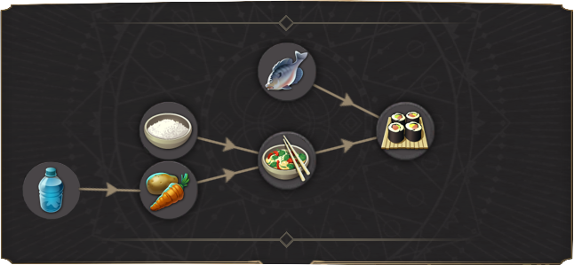

    Für diese Kette werden zwei völlig neue Produkte in den Mod aufgenommen: Feinkost alias Sushi und Biokost, ein Zwischenprodukt in der Produktionskette. Die "ursprüngliche" Biokost wurde in Reis umbenannt und ist die Hauptnahrung für die Arbeiter.

    Die Kette beginnt ganz einfach mit Wasser, das für das Gewächshaus benötigt wird, um Gemüse anzubauen. Gemüse und Reis werden nun in einem Reiskocher zum ersten der vier nicht verwendeten Produkte verarbeitet: Biokost. Diese werden nun mit Fisch, der tiefgefroren aus dem ersten arktischen Sektor kommt, zu Sushi in einer Sushi-Fabrik verarbeitet.

    Später im Spiel kann die Technologie "Fischfangquoten" den Input für Fisch durch Sojabohnen ersetzen.

  - ###  Verjüngungskuren:

    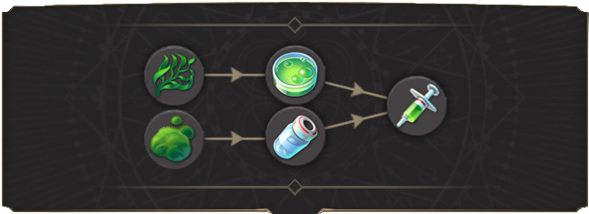

    Diese Produktionskette erfordert die Erschließung der Tundra-Region, um Zugang zu einem der Eingangsprodukte zu erhalten. Die Synthzellen bleiben unverändert. Der neue Input für das Biomedizinische Labor ist Hyaluronsäure, die nur in der Tundra-Region aus Moos hergestellt werden kann.

    Später im Spiel kann die Technologie "Phytopharmazie" den Input für Synthzellen durch Früchte ersetzen.

  - ###  Neuro Implante:

    

    Molybdän ist unverändert. Als zweiter Input wurde Nano-Keramik eingeführt.

  - ###  Luxuskost:

    

    Wasser wurde als zweiter Input für die Rinderfarm eingeführt. Rest ist unverändert.

  - ###  IntelliWear:

    

    Bioresin ist ein neues Vorprodukt für Mikrochips. Alternativ können in der Tundra Mikrochips aus Wolfram hergestellt werden. Auch Flachs wird nun ausschließlich in der Tundra-Region produziert.

  - ###  BioEnhancer:

    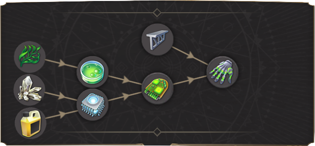

    Die BioEnhancer wurden grundlegend geändert und sind nun wesentlich komplexer als im Originalspiel. Es werden nun Cybersynth-Chips und Titan anstelle von Seltenen Erden benötigt. Bis man die Technologie zur Herstellung der Cybersynth-Chips auf dem Mond erforscht hat, muss man sie aus der Tundra importieren. Die KI- Montagehalle auf dem Mond verwendet Seltene Erden anstelle von Mikrochips, um Cybersynth-Chips herzustellen. Im Endspiel können Cybersynth-Chips auch im Biotech-Forschungslabor auf dem Mars hergestellt werden, wo dafür Silizium und Nährstoffpulver benötigt werden.

  - ###  Quanten-Computer:

    

    Quantencomputer erfordern jetzt die Herstellung von Supraleitern. Diese können nur in der Arktis hergestellt werden und erfordern Superkühlmittel und Nano-Keramik als Input. Da Quantencomputer nun auf der Managerstufe benötigt werden, wird die Diamantenmine früher als zuvor freigeschaltet. Um Quantencomputer zu produzieren, benötigt man mindestens 1 Genie in der Arktis.

    Später im Spiel kann die Technologie "Hardware-Optimierung" den Input für Supraleiter durch Fusionsenergiezellen ersetzen.

  - ###  Schwerkraftkompensatoren:

    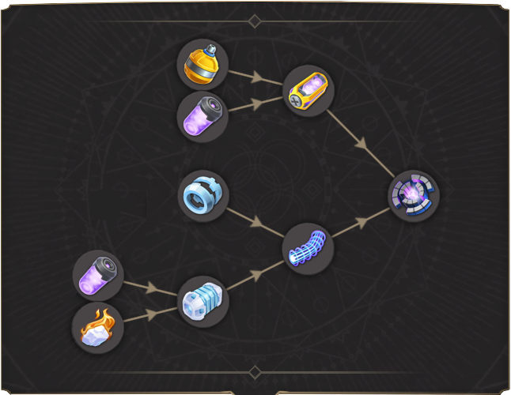

    Schwerkraftkompensatoren benötigen nun auch Supraleiter, die aus der Arktis importiert werden müssen, um sie herzustellen.

  - ###  Replikatoren:

    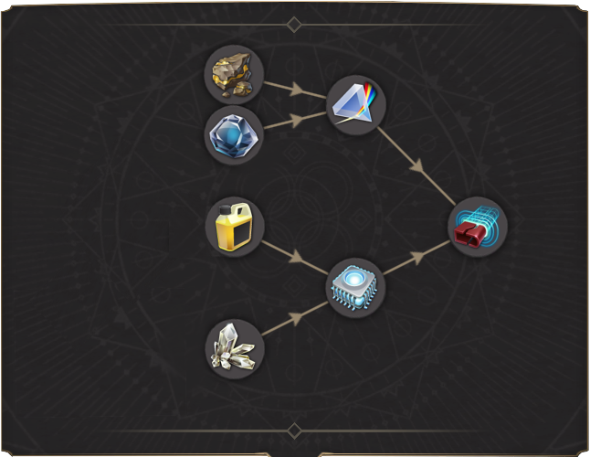

    Replikatoren sind ziemlich normal, die einzige Änderung ist die Notwendigkeit von Bioresin für die Mikrochip-Produktion.

    Später im Spiel kann der Produktionsketten-Input Mikrochips von der Technologie "Halbleiterdotierung" profitieren, um den Input für Bioresin durch Seltene Erden zu ersetzen, was ebenfalls einen Produktivitätsgewinn von 25% bringt.
    Später im Spiel kann der Produktionsketten-Input Multispec-Prismen von der Technologie "Kobaltlegierungen" profitieren, um den Input für Seltene Erden durch Kobalt zu ersetzen. Außerdem können Multispec-Prismen auf dem Mars im Forschungslabor der Schwerindustrie aus denselben Rohstoffen hergestellt werden.

  - ###  Androiden:

    

    Androiden benötigen nun auch die geänderten Cybersynth-Chips. Der andere Input waren früher Synthzellen. Da diese aber bereits Teil der Cybersynth-Chips sind, werden sie zugunsten von Biopolymeren getauscht.

  - ###  Neurale Schnittstellen:

    

    Neurale Schnittstellen sind ein völlig neues Produkt, das mit der Mod eingeführt wurde. Es wird ausschließlich in der arktischen Region hergestellt und erfordert den Einsatz von MultiSpec-Prismen und Supraleitern. Die Kette wird mit Geniuses freigeschaltet. Das Produktionsgebäude ist eines der teuersten in Bezug auf Credit-, Arbeitskräfte- und Energieunterhalt im ganzen Spiel. Neurale Schnittstellen werden auch von Genies und Synthetiks benötigt.

  - ###  NAhrungspacks:

    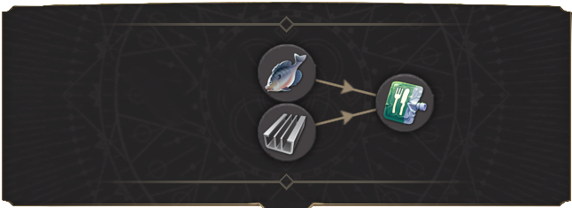

    Nahrungspacks sind die neuen Konservennahrung der Arktis. Aluminium wurde als zusätzlicher Rohstoff hinzugefügt. Nahrungspacks können ab der Manager-Stufe auch auf der Erde produziert werden, um Ihre erste Mondkolonie einfacher zu versorgen. Hier verwendet die Kette Biokost und Aluminium:

    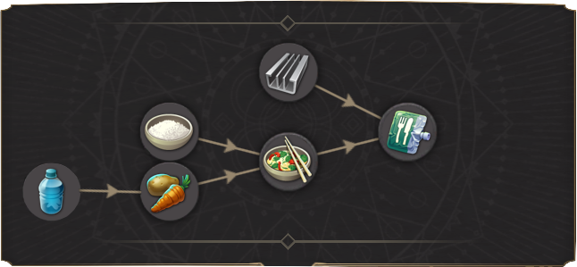

    Das Gleiche gilt für die Mondversion dieser Kette. Mit Offizieren und der Technologie " Aeroponische Landwirtschaft" aus dem Nexus kann man sie auch auf dem Mond herstellen.

    Später im Spiel kann die Technologie "Nachhaltige Verpackung" den Input für Aluminium durch Biopolymere ersetzen.

  - ###  VitaPills:

    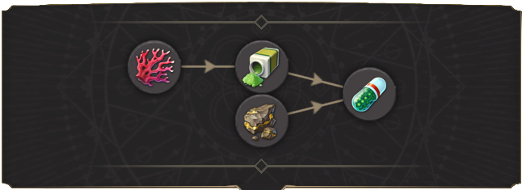

    Umbenennung der Stimulanzien mit einem neuen Symbol. Anstatt nur Korallen zu verwenden, müssen diese zuerst zu Nährstoffpulver verarbeitet werden. Als zweiter Input werden Seltene Erden benötigt. Diese müssen vom Mond geliefert werden.

  - ###  Smart Drones:

    

    Smart-Drohnen sind ein neues Bedürfnis von Wissenschaftlern in der Arktis. Sie können nur in der Tundra hergestellt werden. Da ich die Nano-Prozessoren zu einem anderen Gut recycelt habe, benötigen sie jetzt stattdessen Mikrochips. Diese können in der Tundra aus Wolfram hergestellt werden, genau wie die NanoProzessoren früher.

  - ###  Thermalhüllen:

    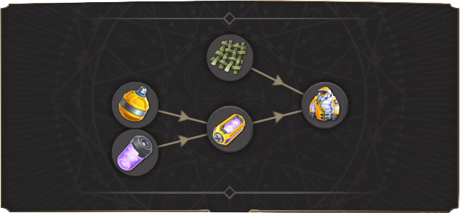

    Thermalhüllen sind ein neues Bekleidungsbedürfnis für Wissenschaftler, Genies und Feldforscher. Sie ähneln der IntelliWear, benötigen aber Fusionsenergiezellen vom Mond anstelle von Mikrochips. Das neue Produkt kann in der Arktis (hier muss Flachs importiert werden) und in Tundra-Regionen hergestellt werden.

    Später im Spiel kann die Technologie "Langsame Methangärung" den Input für Fusionsenergiezellen durch Erdgas ersetzen.

  - ###  Sauerstoff:

    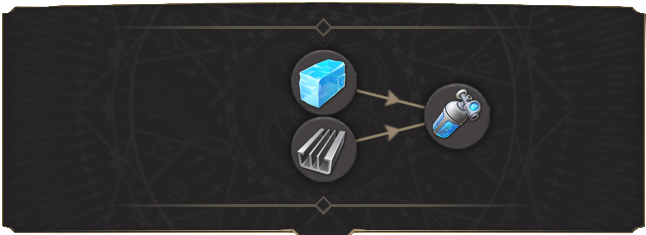

    Für die Sauerstoffproduktion wird nun auch Aluminium aus der neuen Mondaluminiummine benötigt.