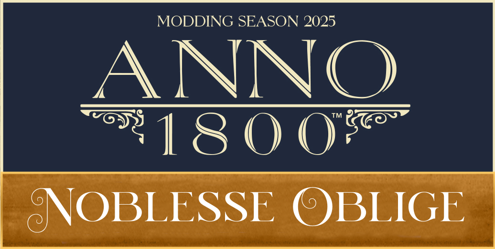

# - Neueste Veröffentlichung -

> Eine Mod in DLC-Größe, die das Konzept des offiziellen "Keim der Hoffnung"-DLCs auf die Alte Welt überträgt und erweitert.

- &#x2022; Neue Bevölkerungsschicht "Großgrundbesitzer"
- &#x2022; Die Gutsverwaltung: Hauptgebäude mit Modulen und fünf neuen Richtlinien
- &#x2022; Neue Rezeptfarmen für die Alte Welt mit modifizierten Sekundärmodulen
- &#x2022; Neue 4x4-Häuser mit neuen Bedürfnissen für die Bevölkerungsstufen 1-3
- &#x2022; Die Fernhandelscompagnie: Import exotischer Produkte aus der ganzen Welt

[Mehr erfahren](/de/Anno1800/NoblesseOblige/NoblesseOblige.md)
[Jetzt herunterladen](https://github.com/Taludas/NoblesseOblige/releases/latest/download/NoblesseOblige.zip)

<!-- background image -->

