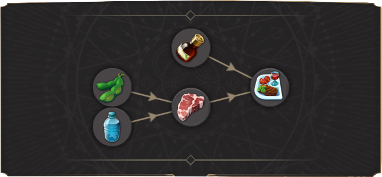
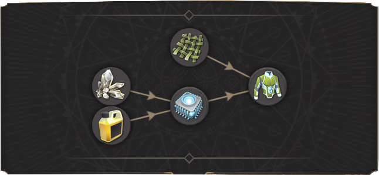
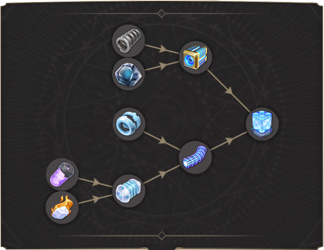
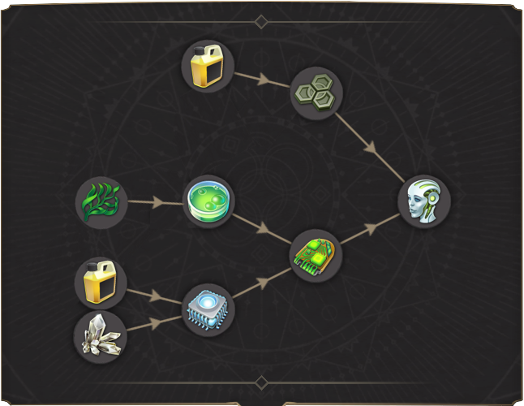
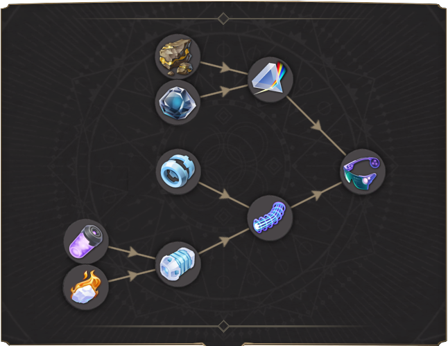

## Overhauled and New Production Chains
In order of appearance:
  - ###  Vitamin Drinks:

    

    Vitamin Drinks now require Algae, that is first processed into Nutrient Powder. It is a multi-region good, as all regions apart from the moon have an option to produce it from a different input:
    - Temperate: Algae
    - Arctic: Deep Water Corals
    - Tundra: Moss
    - Mars: Agricultural Research Laboratory from Deep Water Corals and Moss

    For the Vitamin Drinks Production, extra coastal slots are needed in the beginning, until we can branch off into the other regions.

  - ###  Fine Food:

    

    For this Chain, two completely new products are added for the mod: Fine Food aka Sushi and Organic Food, an intermediate product in its production chain. "Original" Organic Food was renamed to Rice and is the basic Food for Workers.

    The chain starts off very basic with Water, which is needed for the Greenhouse to grow Vegetables. Vegetables and Rice are now combined in a Rice Cooker into the first of the four unused products: Organic Food. Organic Food is now combined with Fish brought in flash frozen from your first Arctic sector into Sushi inside a Sushi Rolling Factory.

    Later in game, the Technology "Fishing Quotas" can replace the input for Fish with Soybeans.

  - ###  Rejuvenators:

    

    This production chain requires opening up the Tundra region to get access to one of the input products. Synth Cells are unchanged. The new input for the Biomedical Laboratory is Hyaluronic Acid which can only be produced in the Tundra region from Moss.

    Later in game, the Technology "Phytopharmacy" can replace the input for SynthCells with Fruits.

  - ###  Neuro Implants:

    

    Molybdenum is unchanged. Nano-Ceramics have been introduced as a second input.

  - ###  Luxury Food:

    

    Water was introduced as a second input for the Cattle Farm. Rest is unchanged.

  - ###  IntelliWear:

    

    Bioresin is a new input product for Microchips. Alternatively Microchips can be produced from Tungsten in the Tundra. Flax has been moved to be produced exclusively in the Tundra region as well.

  - ###  BioEnhancers:

    

    BioEnhancers have been changed to be way more complex than in the original game. Cybersynth Circuits are now required as well as Titanium instead of Rare Earth Elements. Until you research the technology to produce the Cybersynth Circuits on the Moon, you will need to import them from the Tundra. The AI Assembly Hall on the Moon uses Rare Earth Elements instead of Microchips to produce Cybersynth Circuits. In the endgame, Cybersynth circuits can also be produced from the Biotech Research Lab on Mars where it requires Silicon and Nutrient Powder.

  - ###  Quantum Computers:

    

    Quantum Computers now require production of Superconductors. Those can be produced only in the Arctic and require SuperCoolants and Nano-Ceramics as an input. As Quantum Computers are now required at Executive tier, the Diamond Mine is unlocked earlier than before. To produce Quantum Computers you need at least 1 Genius in the Arctic.

    Later in game, the Technology "Hardware Optimization" can replace the input for Superconductors with Fusion Power Cells.

  - ###  Anti-Grav Compensators:

    

    Anti-Grav Compensators now require the input of Superconductors as well, which need to be imported from the Arctic to produce them.

  - ###  Replicators:

    

    Replicators are pretty standard, only change is the requirement for Bioresin for Microchip production.

    Later in game, the Production Chain Input Microchips can benefit from the Technology "Semiconductor Doping" to replace the input for Bioresin with Rare Earth Elements which also gives a 25% productivity boost.
    Later in game, the Production Chain Input Multispec Prisms can benefit from the Technology "Cobalt Alloys" to replace the input for Rare Earth Elements with Cobalt. Additionally, Multispec Prisms can be produced on the Mars in the Heavy industries Research Laboratory from the same inputs.

  - ###  Androids:

    

    Androids now require the changed Cybersynth Circuits as well. The other input used to be Synth Cells. But as those are already part of the Cybersynth Circuit chain, they are dropped in favour of Biopolymers.

  - ###  Neural Interfaces:

    

    Neural Interfaces is a completely new product introduced with the mod. It is produced exclusively in the Arctic region and requires input of MultiSpec-Prisms and Superconductors. The chain is unlocked with Geniuses. It's production building is one of the most expensive in terms of credit-, workforce- and energy maintenance in the entire game. Neural Interfaces are also required by Geniuses and Synthetics.

  - ###  Sustenance Packs:

    

    Sustenance Packs essentially is the reworked Canned Food product from Arctic. Aluminum was added as an additional input. Sustenance Packs can also be produced on Earth from Manager Tier onwards to supply your first Moon Colony more easily. Here the chain uses Organic Food and Aluminum:

    

    The same is true for the Moon version of this chain. With Officers and the Aeroponic Farming tech from the Nexus you get the opportunity to produce them on the Moon as well.

    Later in game, the Technology "Sustainable Packaging" can replace the input for Aluminum with Biopolymers.

  - ###  VitaPills:

    

    Renamed Stimulants with a new icon. Instead of only using Corals, those need to be processed into Nutrient Powder first. As a second input Rare Earth Elements are necessary. Those need to be shipped from the Moon.

  - ###  Smart Drones:

    

    Smart Drones are a new need of the Scientists in the Arctic. They can only be produced in the Tundra. As I recycled the Nanometre Processors into another good, they now require Microchips instead. Those can be produced from Tungsten in the Tundra just like the Nanometre Processors used to be.

  - ###  Thermal Shells:

    

    Thermal Shells are a new clothing need for Scientists, Geniuses and Field Researchers. They are similar to IntelliWear, but require Fusion Power Cells from the Moon instead of Microchips. The new product can be produced in Arctic (requiring importing flax as well) and in Tundra regions.

    Later in game, the Technology "Slow Methane Fermentation" can replace the input for Fusion Power Cells with Natural Gas.

  - ###  Oxygen:

    

    Oxygen production now requires Aluminum from the new Moon Aluminum Mine as well.