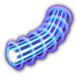

## Overhauled Public Buildings
  - **Services** are a newly introduced product that can only be produced by Public Buildings. I created them to overhaul and diversify the 2205 Public Building game mechanic.
  - Corporation HQ is now limited to 1 per sector.
  - Public buildings now take **4t/min** of varying input goods to produce Services. In addition, **Urbanisiation** is provided passively. This product uses the "regular" 2205 Public Building mechanic.

###  Earth
- || **Name**|**Input**|**Output Services**|**Output Urbanisation** |
|---|---|---|---|---|
|| Community Center|nothing|
10
|
10
|
|| Police Station|  Smart Drones|
25
|
20
|
|| Metro Station| Superconductors|
30
|
75
|
|| Infodrome| Quantum Computers|
75
|
30
|
|| Stadium| Androids &  Fusion Power Cells|
150
|
50
|
|| Maintenance Station| Construct-o-Bots &  Cybersynth Circuits|
80
|20 Maintenance (Synths)|
|| Corporation Headquarter|nothing|
250
|
100
|

###  Arctic
- || **Name**|**Input**|**Output Services**|**Output Urbanisation** |
|---|---|---|---|---|
|| Community Center|nothing|
2.5
|
5
|
|| Health Center| Rejuvenators|
10
|
10
|
|| Infodrome| Microchips|
20
|
20
|
|| Secrecy Lab| SmartDrones &  Anti-Gravity Compensators|
40
|
40
|

###  Moon
- || **Name**|**Input**|**Output Services**|**Output Urbanisation** |
|---|---|---|---|---|
|| Maintenance Station| Construct-o-Bots|
10
|
10
|
|| Health Center| MediBots|
20
|
15
|

###  Tundra
- || **Name**|**Input**|**Output Services**|**Output Urbanisation** |
|---|---|---|---|---|
|| Health Center| Rejuvenators|
10
|
5
|
|| Infodrome| Quantum Computers|
20
|
10
|

###  Mars
- || **Name**|**Input**|**Output Services**|**Output Urbanisation** |
|---|---|---|---|---|
|| Maintenance Station| Construct-o-Bots &  Cybersynth Circuits|
40
|20 Maintenance (Synths)|