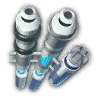

# Neues im Spiel

### Neue Produkte

|**Produkt**|**Nährstoffpulver**|**Biokost**|**Sushi**|**Hyaluronsäure**|**Nahrungspacks**|**Thermalhüllen**|**Supraleiter**|**Neurale Schnittstellen**|**Dienstleistungen**|
|---|---|---|---|---|---|---|---|---|---|
|**Icon**|

|

|

|

|

|

|

|

|

|

### Mars Session
- Die neue Mars- Session befindet sich in der oberen rechten Ecke der Strategiekarte. Sie ist zugänglich, nachdem man eine neue Questlinie abgeschlossen hat, die verfügbar ist, sobald man das Mondlizenzprogramm und die Sektor-Story-Questlinie des Grünflut-Archipels um die Synths abgeschlossen hat.
- 10 neue Mars-Sektor-Eigenschaften für den neuen Sektor. Eine Eigenschaft wird beim ersten Betreten des Sektors zufällig ausgewählt. Mit einer speziellen Geo-Engineering-Quest kann man die Sektoreigenschaft auch neu würfeln (Achtung: normales Neuwürfeln ergibt Mond-Eigenschaften!) Für Details siehe: [hier](/de/Anno2205/SectorTraits.md)
- 4 Jahreszeiten für die Mars-Session, die in regelmäßigen Abständen wechseln. Jede Jahreszeit hat ihren eigenen Katastropheneffekt, mit dem der Spieler zurechtkommen muss. Um den erhöhten Schwierigkeitsgrad zu kompensieren, bietet jede Jahreszeit auch einen Bonus für bestimmte Gebäude:
|**Jahreszeit**|**Länge**|**Effekt**|
|---|---|---|
| Sommer|`Auftragszeit = Lang` = 60 min   `Auftragszeit = Mittel` = 30 min   `Auftragszeit = Kurz` = 15 min|**Sonnenstürme**   Energietransfer ineffektiv   Solarmodule haben höhere Produktivität|
| Herbst|`Auftragszeit = Long` = 30 min   `Auftragszeit = Medium` = 15 min   `Auftragszeit = Kurz` = 7:30 min|**Vulkanische Aktivität**   Minenbauplätze geschlossen|
| Winter|`Auftragszeit = Long` = 60 min   `Auftragszeit = Medium` = 30 min   `Auftragszeit = Kurz` = 15 min|**Trockeneis-Stürme**   Marsianische Synths brauchen mehr Dienstleistungen   Methaneis-Extraktoren haben höhere Produktivität|
| Frühling|`Auftragszeit = Long` = 30 min   `Auftragszeit = Medium` = 15 min   `Auftragszeit = Kurz` = 7:30 min|**Staubstürme**   Handelsrouten unterbrochen   Windpark, KREEP Sammler und Diamond-Extraktor haben höhere Produktivität|

[filename](/marsseasonsgallery.html ':include')

### Neue Hauptquest
- *"30. Die KI Revolution": Siedlen SIe 50000 Synthetics an* 
  Nach der erfolgreichen Kolonisierung des Mondes sehnt sich die Menschheit nach einer weiteren galaktischen Expansion und steht erneut vor der gewaltigen Herausforderung, eine Mission zum Mars durchzuführen, um dort das Leben in der rauen Umgebung des Planeten zu ermöglichen. Da es keine Chance gibt, dass die Menschen diese Reise mit der derzeitigen Technologie überleben können, stellt die Global Union Sie vor die Aufgabe, eine fortschrittliche künstliche Intelligenz zu entwickeln, die in der Lage ist, die enormen Hindernisse dieser interplanetaren Reise und der Kolonisierung des Roten Planeten zu überwinden.

- *"31. Die zweite Mars-Mission": Siedeln Sie 10000 Genies an und rüsten Sie Ihren Transmissions-Raumhafen in einem Ihrer Mondsektoren mit einer Mars- Startrampe auf.* 
  Nach mehr als hundert Jahren sind Sie auserwählt, die Menschheit auf ihre zweite Expedition zum Roten Planeten vorzubereiten. Umfangreiche Forschungen Ihrer besten Raumfahrtingenieure sind notwendig, um ein robustes Raketensystem zu entwickeln, das die beschwerliche Reise zum Mars übersteht.

- *"32.  Die erste marsianische KI-Kolonie": Siedeln Sie 1000 marsianische Synths an.* 
  Herzlichen Glückwunsch! Wieder einmal haben Sie alle Erwartungen übertroffen, indem Sie die zweite Mission zum Mars mit Bravour gemeistert haben. Eure ersten Synthetics haben erfolgreich die Oberfläche des Roten Planeten betreten. Sorgen Sie nun für eine ausreichende Versorgung mit Gütern und Ressourcen, um Ihre Androiden in der staubigen Umgebung des Mars dauerhaft zu betreiben. Setzen Sie den Ausbau Ihrer ersten Kolonie fort, um die reichhaltigen Ressourcen dieses unbekannten Planeten auszunutzen, und bauen Sie eine starke zusätzliche Forschungsbasis auf, um Ihre Orbitalstation zu unterstützen.

- *"33. Instandhaltung der Kolonie": Bauen Sie einen Mars-Forschungscluster und generieren Sie Ihre erste Expertise auf dem Mars* 
  Nachdem Sie nun eine anständige Belegschaft aufgebaut haben, sollten Sie damit beginnen, einige Dinge vor Ort zu produzieren, um sicherzustellen, dass Ihre Androiden im rauen Marsklima überleben können. Unser oberstes Ziel ist es, bei der Produktion von Dienstleistungen autark zu sein. Dies ist ein mehrstufiger Prozess, der Sie auch mit den Funktionen der marsianischen Forschungslabors vertraut machen wird. Der Anfang ist der Bau eines eigenen kleinen Forschungszentrums.

- *"33.1 Instandhaltung der Kolonie": Bauen Sie ein Energieforschungslabor und produzieren Sie Gas auf dem Mars* 
  Sie können die Produktion von Expertise unterstützen, indem Sie zusätzliche Forschungslabore auf dem Mars bauen. Jede Spezialisierung hat ihre eigenen Input-Güter und produziert ein spezifisches Output-Produkt zusätzlich zu der üblichen Expertise. Der Produktionskreislauf für Dienstleistungen beginnt mit dem Energielabor, das aus dem vor Ort geförderten Methaneis Gas herstellt.

- *"33.2 Instandhaltung der Kolonie": Bauen Sie ein landwirtschaftliches Forschungslabor und produzieren Sie Nährstoffpulver auf dem Mars* 
  Der nächste Schritt ist die landwirtschaftliche Forschung, die notwendig ist, um die grundlegendsten Lebensformen auf dem Mars zu erhalten: Korallen und Moos. Beginnen Sie damit, einen Teil des Methaneises zu filtern, um etwas Restwasser daraus zu gewinnen, das Sie dann verwenden können, um die allerersten Pflanzen auf dem Mars anzubauen - die Grundlage für späteres menschliches Leben auf dem Mars!

- *"33.3 Instandhaltung der Kolonie": Bauen Sie ein Forschungslabor für Schwerindustrie und produzieren Sie Multispec-Prismen auf dem Mars* 
Nachdem wir eine der Komponenten für die Cybersynth-Chips hergestellt haben, sollten wir den Marsstaub nach den seltenen Rohstoffen untersuchen, die sich unter seiner rostigen Oberfläche verbergen. Wir brauchen diese, um hochwertige Linsen für die weitere Mineralienverarbeitung herzustellen.

- *"33.4 Instandhaltung der Kolonie": Bauen Sie ein Elektronik-Forschungslabor und produzieren Sie Silizium auf dem Mars* 
  Mit den entsprechenden Linsen ausgestattet, werden ihre Forscher in der Lage sein, die seltenen Ressourcen des Roten Planeten zu analysieren und sie aufzutrennen, um sie für die Herstellung von Cybersynth-Chips zu verwenden.

- *"33.5 Instandhaltung der Kolonie": Bauen Sie ein Biotech-Forschungslabor und produzieren Sie Cybersynth-Chips auf dem Mars* 
  Sie haben es geschafft! Die letzten Vorbereitungen sind abgeschlossen und die ersten lokal produzierten Cybersynth-Schaltkreise verlassen Ihr Biotech-Labor! Dies ist der entscheidende Schritt auf dem Weg zu einem sich selbst erhaltenden Androiden-Leben auf dem Mars - Ihre Maschinen werden in der Lage sein, sich selbst zu analysieren, zu reparieren und zu verbessern, ohne dass Sie sich darum kümmern müssen. Da Ihre Marskolonie nun vollständig mit Forschungslabors aller Art ausgestattet ist, sollten Sie Ihre Marsbevölkerung unbedingt weiter ausbauen, um so den Weg zum vollständigen Wissen um die Geheimnisse des Roten Planeten zu beschreiten!

- *" Das Marsianische KI-Forschungsprogramm - Schritte 1 bis 15": Siedeln Sie insgesamt 75000 marsianische Synths an.* 
Indem Sie die Anzahl der Synths auf dem Mars weiter erhöhen, können Sie nun auch weitere Werkstätten- und Modul- Genehmigungen freischalten, um die Kapazitäten Ihrer Orbitalstation noch weiter zu steigern: Pro 5000 Mars-Synths können Sie eine zusätzliche Werkstattgenehmigung für Ihre Orbitalstation freischalten, zusammen mit einigen weiteren Modulen und Konnektoren. Insgesamt können Sie 14 zusätzliche Genehmigungen erhalten, so dass Sie nun die Forschungsmöglichkeiten des Nexus voll ausschöpfen können, indem Sie 5 Werkstätten jeder Spezialisierung bauen. Wenn Sie die maximale Bevölkerungszahl erreicht haben, schalten Sie die Technologie frei, mit der Sie die Sektoreigenschaft des Mars in eine zufällige neue Eigenschaft umwandeln können.

### Neue Mars-Gebäude
- Mars Straße
- Mars Logistikzentrum
- Mars Windpark (Minenbauplatz)
- Mars Solarpanel
- Kleiner und großer Schildgenerator
- Marsianische Wohnhäuser
- KI-Wartungsstation auf dem Mars
- Marsianischer Methaneisextractor
- Marsianische Kobalt-Tagebaumine
- Marsianische Titan-Tagebaumine
- Marsianische Wolfram-Tagebaumine
- Marsianischer Selten-Erden-Extraktor
- Marsianischer Feldspat-Steinbruch
- Mars-Diamanten-Extraktor
- Marsianischer Ionenschweißer
- Mars-Roboter-Montagehalle
- Marsianischer Methaneis-Filter
- Mars-Korallen-Züchter
- Mars-Moos-Züchter
- **Forschungscluster:** Erzeugt Expertise und Energie ohne Input-Güter, nutzt dafür aber einen größeren Radius (Überschneidungen mit dem Mars- Solarpanel)
- **Forschungslabor für marsianische Landwirtschaft:** Erzeugt Expertise und Nährstoffpulver aus Tiefwasserkorallen und Moos, verwendet einen kleineren Radius (Überschneidungen mit anderen Forschungslabors)
- **Marsianisches Biotech-Forschungslabor:** Erzeugt Expertise und Cybersynth-Chips aus Silizium und Nährstoffpulver, nutzt einen kleineren Radius (Überschneidungen mit anderen Forschungslabors)
- **Marsianisches Elektronik-Forschungslabor:** Erzeugt Expertise und Silizium aus Seltenen Erden und MultiSpec-Prismen, nutzt einen kleineren Radius (Überschneidungen mit anderen Forschungslabors)
- **Marsianisches Energie-Forschungslabor:** Erzeugt Expertise und Erdgas aus Methaneis und Wolfram, nutzt einen kleineren Radius (Überschneidungen mit anderen Forschungslabors)
- **Marsianisches Forschungslabor für Schwerindustrie:** Erzeugt Expertise und MultiSpec-Prismen aus Diamanten und Seltenen Erden, nutzt einen kleineren Radius (Überschneidungen mit anderen Forschungslabors)
- und entsprechende primäre und sekundäre **Module** für diese Labore: Gewächshaus, Schwerkraftlabor, Stauplattform, Solarzellen, Kühler, Recyclingstation. Es sind auch Verbindungsstücke verfügbar, wenn ihr sie mögt.

[filename](/newmarsbuildingsgallery.html ':include')

- |**Modul**| **Gewächshaus**| **Schwerkraftlabor**| **Recyclingstation**| **Solarzellen**| **Stauplattform**| **Kühler** |
|---|---|---|---|---|---|---|
|***Output***|
+15%
|
+15%
|
+15%
|
+10%
|
+10%
|
-
|
|***Input***|
+10%
|
+10%
|
-10%
|
-
|
-
|
-5%
|
|***Maintenance***|
+25%
|
+25%
|
+100%
|
-15%
|
-15%
|
-15%
|
|***Workforce***|
+25%
|
+25%
|
+100%
|
+15%
|
-15%
|
+15%
|
|***Energy***|
+25%
|
+25%
|
+100%
|
-15%
|
+15%
|
+15%
|

### Neue arktische Tier 3-Bevölkerung: Genies
- 37,5% der verfügbaren Wissenschaftler in der Arktis können nun zu einer neuen Tier 3 Bevölkerung aufgewertet werden: **Genies**
| 
**Name**
|
**Portrait**
|
**Wohnhaus**
|
**Bedürfnisse**
|
**Daten**
|
|---|---|---|---|---|
|Genies|||  **Quantencomupter**    **MediBots**    **Androiden**     **Neurale Schnittstellen**    **Dienstleistungen**| **Einwohner pro Haus:** 250    **Arbeitskräfte** (Plenty/Medium/Sparse): 250/200/150    **Einkommen**: 2024  |

### Neue Produktionsgebäude für die überarbeiteten Produktionsketten und die neuen öffentlichen Gebäude

- Gemeinschaftszentrum Erde
- Labor für Nährstoffverarbeitung Erde/Tundra/Arktis
- Gemüsefarm Erde
- Biokostfabrik Erde
- Feinkostküche Erde
- Solarpark Erde/Tundra/Arktis
- Fabrik für Nahrungspacks Erde
- KI-Wartungsstation Erde
- Wasserpumpe Tundra
- Hyaluron-Konzentrator Tundra
- Offshore-Bohrinsel Tundra
- Tundra Gesundheitszentrum
- Boreale Schneiderei Tundra
- Tundra-Infodrom
- Arktisches Gesundheitszentrum
- Arktis-Schneiderei
- Methangas-Raffinerie
- Kleiner Heizofen
- Arktisches Infodrom
- Supraleiter-Fertigungshalle
- Fabrik für Neuronale Schnittstellen
- Mondeisschmelze
- Aluminium-Mine Mond
- Fabrik für Nahrungspacks Mond
- Biokostfabrik Mond
- Luxuskost-Manufaktur Mond
- Synthzellen-Inkubator Mond
- KI-Montageanlage Mond

### Aeroponische Farmen und Lebensmittelproduktion auf dem Mond

Eines der neuen Features auf dem Mond ist die Möglichkeit, jedes beliebige landwirtschaftliche Produkt durch Aeroponische Farmen zu produzieren. Diese müssen zuerst im Nexus freigeschaltet werden (Landwirtschaft-Biotechnologie Stufe 3). Die Aeroponische Farm benötigt zum Betrieb Wasser und Sauerstoff. Mit dieser Mod gibt es die Möglichkeit, Wasser auf dem Mond aus Mondeis und Nano-Keramik zu produzieren. Aeroponische Farmen können ein Vielfaches ihrer Gegenstücke auf der Erde produzieren.
Eine weiteres Feature dieser Mod ist die Möglichkeit, einen Teil des Nahrungsmittelbedarfs auch auf dem Mond zu produzieren. Es stehen Nahrungspacks und Luxuskost zur Verfügung. Für ersteres und Sauerstoff habe ich eine neue Aluminiummine auf dem Mond eingeführt. Die Produktionskette für Luxusnahrung auf dem Mond benötigt Biokost und Wein. Biokost kann auch hier produziert werden, aus Reis und Gemüse mit dem Aeroponischen Farming System.

[filename](/newbuildingsgallery.html ':include')