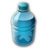
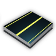

## Überarbeitete Bedürfnisse
   Jede Bevölkerungsstufe benötigt die Bedürfnisse ihrer Vorgänger zusätzlich zu ihren eigenen. Die Synthetiks folgen dieser Logik jedoch nicht.

   | **Tier**|**Bedürfnis**||**Tier**|**Bedürfnis** || **Tier**|**Bedürfnis**||**Tier**|**Bedürfnis** |
   |---|---|---|---|---|---|---|---|---|---|---|
   || **Wasser**    **Reis**    **Urbanisierung**    **Dienstleistungen**    **Energie**||| **Nahrungspacks**    **Vitamin-Drinks**    **Neuro Implante**    **Urbanisierung**    **Dienstleistungen**||| **Suaerstoff**    **Nahrungspacks**    **Verjüngungskuren**    **VitaPills**    **Urbanisierung**    **Dienstleistungen**||| **Vitamin-Drinks**    **Sushi**    **Smart-Dronen**    **Urbanisierung**    **Dienstleistungen**|
   || **Vitamin-Drinks**    **Sushi**    **Neuro Implante**    **Verjüngungskuren**    **Dienstleistungen**||| **VitaPills**    **Sushi**    **Smart-Dronen**    **Thermalhüllen**    **Dienstleistungen**||| **Luxuskost**    **BioEnhancer**    **IntelliWear**    **Schwerkraftkompensatoren**    **Dienstleistungen**||| **Luxuskost**    **Thermalhüllen**    **MediBots**    **Replikatoren**    **Dienstleistungen**|
   || **Luxuskost**    **IntelliWear**    **BioEnhancer**    **Quantum PCs**    **Dienstleistungen**||| **Quantum PCs**    **MediBots**    **Androiden**    **Neurale Schnittstellen**    **Dienstleistungen**|||||||
   || **Replikatoren**    **Androiden**    **Schwerkraftkompensatoren**    **Neurale Schnittstellen**    **Dienstleistungen**||
   || **IntelliWear**    **BioEnhancer**    **Neurale Schnittstellen**    **Wartung**    **Energie**|||||||
