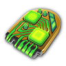

## Überarbeitete Öffentliche Gebäude
  - **Dienstleistungen** sind ein neu eingeführtes Produkt, das nur von öffentlichen Gebäuden hergestellt werden kann. Ich habe sie entwickelt, um die Spielmechanik der öffentlichen Gebäude von 2205 zu überarbeiten und zu diversifizieren.
  - Öffentliche Gebäude benötigen nun **4t/min** an unterschiedlichen Inputgütern, um Dienstleistungen zu produzieren. Darüber hinaus wird **Urbanisierung** passiv bereitgestellt. Dieses Produkt verwendet die "normale" 2205 Öffentliche Gebäude-Mechanik.

###  Erde
- || **Name**|**Input**|**Output Dienstleistungen**|**Output Urbanisierung** |
|---|---|---|---|---|
|| Gemeinschaftszentrum|nichts|
10
|
10
|
|| Sicherheitsabteilung|  Smart-Drohnen|
25
|
20
|
|| Metro| Supraleiter|
75
|
40
|
|| Infodrome| Quantencomputer|
75
|
40
|
|| Stadion| Androiden &  Fusionsenergiezellen|
150
|
80
|
|| Wartungsstation| Baubots &  Cybersynth-Chips|
80
|20 Wartung (Synths)|
|| Firmenhauptquartier|nichts|
250
|
100
|

###  Arktis
- || **Name**|**Input**|**Output Dienstleistungen**|**Output Urbanisierung** |
|---|---|---|---|---|
|| Gemeinschaftszentrum|nichts|
2.5
|
5
|
|| Gesundheitszentum| Verjüngungskuren|
10
|
10
|
|| Infodrome| Mikrochips|
20
|
20
|
|| Hochsicherheitslabor| Smart-Drohnen &  Schwerkraftkompensatoren|
40
|
40
|

###  Mond
- || **Name**|**Input**|**Output Dienstleistungen**|**Output Urbanisierung** |
|---|---|---|---|---|
|| Wartungsstation| Baubots|
10
|
10
|
|| Gesundheitszentum| MediBots|
20
|
15
|

###  Tundra
- || **Name**|**Input**|**Output Dienstleistungen**|**Output Urbanisierung** |
|---|---|---|---|---|
|| Gesundheitszentum| Verjüngungskuren|
10
|
5
|
|| Infodrome| Quantencomputer|
20
|
10
|

###  Mars
- || **Name**|**Input**|**Output Dienstleistungen**|**Output Urbanisierung** |
|---|---|---|---|---|
|| Wartungsstation| Baubots &  Cybersynth-Chips|
40
|20 Wartung (Synths)|