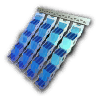

# Additions to the Game

### New Products

|**Product**|**Nutrient Powder**|**Organic Food**|**Fine Food**|**Hyaluronic Acid**|**Sustenance Packs**|**Thermal Shells**|**Superconductors**|**Neural Interfaces**|**Services**|
|---|---|---|---|---|---|---|---|---|---|
|**Icon**|

|

|

|

|

|

|

|

|

|

### Mars Session
- The new Mars Session can be found in the upper right corner of the strategic view. It is accessible after completing a new questline available once you have completed the Lunar Licensing Program and the Greentide Archipelago's sector story questline surrounding the Synths. 
- Add 10 New Mars Sector Traits for the new sector. One trait is distributed to it randomly on first entry. With a special geo-engineering quest you can reroll the sector trait as well (Warning: normal rerolling results in Moon Traits!) For details see: [here](/en/Anno2205/SectorTraits.md) 
- Add 4 seasons to the Mars session, which cycle in regular intervals. Each season has its own unique calamity effect that the player will have to deal with. To compensate for the increased difficulty, each season also has a bonus for certain buildings:
|**Season**|**Length**|**Effect**|
|---|---|---|
| Summer|`Assignment Time = Long` = 60 min   `Assignment Time = Medium` = 30 min   `Assignment Time = Short` = 15 min|**Solar Flares**   Energy Transfer Routes ineffective   Solar Panels have higher productivity|
| Autumn|`Assignment Time = Long` = 30 min   `Assignment Time = Medium` = 15 min   `Assignment Time = Short` = 7:30 min|**Vulcanic Activity**   Mining sites closed|
| Winter|`Assignment Time = Long` = 60 min   `Assignment Time = Medium` = 30 min   `Assignment Time = Short` = 15 min|**Dry Ice Rain**   Martian Synths need more Services   Methane Ice Extractors have higher productivity|
| Spring|`Assignment Time = Long` = 30 min   `Assignment Time = Medium` = 15 min   `Assignment Time = Short` = 7:30 min|**Dust Storms**   Traderoutes shout down   Windpark, KREEP Gatherer and Diamond Extractor have higher output|

[filename](/marsseasonsgallery.html ':include')

### New Main Quests
- *"30. The AI Revolution": Settle 50000 Synthetics* 
  As humanity craves for even more galactic expansion after your successful Moon colonization, the daunting challenge to conduct a second mission to Mars and of sustaining life in the harsh Martian environment presents itself once again. As there is no chance that humans can survive this journey with current technology, the Global Union presents you with the task to develop an advanced artificial intelligence that is capable to overcome the formidable obstacles of interplanetary travel and colonization.

- *"31. The Second Mars Mission": Settle 10000 Geniuses and upgrade your Transmission Spaceport in one of your Moon sectors with a Mars Launcher.* 
  After more than one hundred years, you are chosen to ready humanity for its second expedition to the Red Planet. Extensive research conducted by your foremost aerospace engineers is imperative for the development of a robust rocket system capable of enduring the arduous journey to Mars.

- *"32.  The First Martian AI Colony": Settle 1000 Martian Synths.* 
  Congratulations! Once more, you've surpassed expectations with excellence in executing the second mission to mars. Your inaugural Synthetics have successfully treaded upon the surface of the Red Planet. Ensure an ample provision of goods and resources to maintain your androids amidst the dusty Martian environment. Continue in expanding your first colony to allow exploiting the ample resources of this unknown ground and build up a strong additional Expertise gain to support your Orbital Station.

- *"33. Maintaining the Colony": Build a Martian Research Cluster and generate your first Expertise on Mars* 
  Now that you've built up a decent workforce, let's start producing some things locally to ensure your Androids can survive in the harsh Martian climate. Our ultimate goal is to be self-sufficient in the production of services. This is a multi-step process that will also familiarise you with the functions of the Martian Research Laboratories. Our first step is the construction of a small research hub.

- *"33.1 Maintaining the Colony": Build an Energy Research Laboratory and produce Natural Gas on Mars* 
  We can support the production of Expertise by building additional Research Labs on Mars. Each specialisation has it's own input goods and produces a specific output product in addition to the usual Expertise. The loop to produce Services starts with the Energy Lab, that produces Gas from the locally mined Methane Ice.

- *"33.2 Maintaining the Colony": Build an Agricultural Research Laboratory and produce Nutrient Powder on Mars* 
  The next step is agricultural research, which is necessary to support the most basic forms of life on Mars: Corals and Moss. Start by filtering some of the Methane Ice for some residual Water, which you can then use to grow the very first plants on Mars - the foundation for human life on Mars!

- *"33.3 Maintaining the Colony": Build a Heavy Industry Research Laboratory and produce Multispec Prisms on Mars* 
  With one of the ingredients for Cybersynth Circuits out of the way, let's start digging up some Martian dust to scour for the rare resources that are hidden beneath its rusty crust. We need these to manufacture high quality lenses for further mineral processing.

- *"33.4 Maintaining the Colony": Build an Electronics Research Laboratory and produce Silicon on Mars* 
  Equipped with the appropriate lenses, you will be able to start analysing and separating all of the rare resources of the Red Planet for further use in the production of Cybersynth Circuits.

- *"33.5 Maintaining the Colony": Build a Biotech Research Laboratory and produce Cybersynth Circuits on Mars* 
  You have done it! The final preparations are complete and the first locally produced Cybersynth Circuits are rolling out of your Biotech Lab! This is the crucial step towards basic self-sustaining Android life on Mars - your machines will be able to analyse, repair and improve themselves without you having to intervene. With your Martian colony now fully equipped with research labs of all kinds, it is highly recommended that you strengthen your Martian population and continue on this path to total knowledge!

- *"The Martian AI Research Program - Steps 1 to 15": Settle 75000 Martian Synths in total.* 
  By increasing your population of Synths on the Mars you can now unlock more Workshop- and Module-Permits to expand the capabilities of your Orbital Station even further: Per 5000 Martian Synths you unlock 1 extra workshop permit for your Orbital Station along with some more modules and connectors. A total of 14 additional permits can be gained, so that you can now fully exploit the Nexus' research capabilities by building 5 workshops of each specialisation. Upon reaching the maximum required population you unlock the technology to geo-engineer the Mars' sector trait to a random new one.

### New Mars Buildings

- Mars Tracks
- Martian Transportation Center
- Martian Windpark (mine slot)
- Martian Solar Panel
- Small and Large Shield Generator
- Martian Dwellings
- Martian AI Maintenance Station
- Martian Gas Drilling Rig
- Martian Cobalt Open Pit Mine
- Martian Titanium Open Pit Mine
- Martian Tungsten Open Pit Mine
- Martian Rare Earth Extractor
- Martian Feldspar Quarry
- Martian Diamond Extractor
- Martian Ion Welder
- Martian Robot Assembly Hall
- Martian Methane Ice Filter
- Martian Coral Breeder
- Martian Moss Breeder
- **Research Cluster:** Generates Expertise and Energy without input goods, but uses a larger radius instead (overlaps with Martian Solar Panel)
- **Martian Agriculture Research Lab:** Generates Expertise and Nutrient Powder from Deep Water Corals and Moss, uses a smaller radius (overlaps with other Research Labs)
- **Martian Biotech Research Lab:** Generates Expertise and Cybersynth Circuits from Silicon and Nutrient Powder, uses a smaller radius (overlaps with other Research Labs)
- **Martian Electronics Research Lab:** Generates Expertise and Silicon from Rare Earth Elements and MultiSpec Prisms, uses a smaller radius (overlaps with other Research Labs)
- **Martian Energy Research Lab:** Generates Expertise and Natural Gas from Methane Ice and Tungsten, uses a smaller radius (overlaps with other Research Labs)
- **Martian Heavy Industry Research Lab:** Generates Expertise and MultiSpec Prisms from Diamonds and Rare Earth Elements, uses a smaller radius (overlaps with other Research Labs)
- and corresponding primary and secondary **Modules** to those Labs: Greenhouse, Artificial G-Lab, Storage Platform, Solar Panel, Radiator, Recycling Station. There are also connectors available if you like them.

[filename](/newmarsbuildingsgallery.html ':include')

- |**Module**| **Greenhouse**| **Artificial-G Lab**| **Recycling Module**| **Solar Cells**| **Storage Platform**| **Cooling Module** |
|---|---|---|---|---|---|---|
|***Output***|
+15%
|
+15%
|
+15%
|
+10%
|
+10%
|
-
|
|***Input***|
+10%
|
+10%
|
-10%
|
-
|
-
|
-5%
|
|***Maintenance***|
+25%
|
+25%
|
+100%
|
-15%
|
-15%
|
-15%
|
|***Workforce***|
+25%
|
+25%
|
+100%
|
+15%
|
-15%
|
+15%
|
|***Energy***|
+25%
|
+25%
|
+100%
|
-15%
|
+15%
|
+15%
|

### New Tier 3 Arctic Population: Geniuses
- 37,5% of the available Scientists in the Arctic can now be upgraded to a new Tier 3 Population: **Geniuses**
| 
**Name**
|
**Portrait**
|
**Housing**
|
**Needs**
|
**Stats**
|
|---|---|---|---|---|
|Geniuses|||  **Quantum Computers**    **MediBots**    **Androids**     **Neural Interfaces**    **Services**| **Residents per House:** 250    **Workforce generation** (Plenty/Medium/Sparse): 250/200/150    **Tax generation**: 2024  |

### New Production Buildings for the overhauled Production Chains and the new Public Buildings

- Community Center Earth 
- Nutrient Processing Laboratory Earth/Tundra/Arctic 
- Vegetable Farm Earth 
- Organic Food Factory Earth 
- Fine Food Kitchen Earth 
- Solar Park Earth/Tundra/Arctic 
- Sustenance Packs Factory Earth 
- AI Maintenance Station Earth 
- Water Pump Tundra 
- Hyaluron Concentrator Tundra 
- Off-shore Drilling Rig Tundra 
- Tundra Healthcenter 
- Boreal Tailor Tundra 
- Tundra Infodrome 
- Arctic Health Center 
- Arctic Tailor 
- Methane Gas Refinery 
- Small Heater 
- Arctic Infodrome 
- Superconductor Fabrication Hall 
- Neural Interfaces Factory 
- Moon Ice Melter 
- Aluminum Mine 
- Sustenance Pack Factory 
- Organic Food Factory 
- Luxury Food Manufactory 
- Synthcell Incubator Moon 
- AI Composition Plant Moon 

### Moon Aeroponic Farms and Food Production

One of the new features on the Moon is the possibility to produce any farming product through Aeroponic Farms. Those need to be unlocked first in the Nexus (Agriculture-Biotech tier 3). The Aeroponic Farm requires Water and Oxygen to operate. With this mod there is the option to produce Water on Moon from Moonice and Nano-Ceramics. Aeroponic Farms can produce a multiple of their counterparts on the earth.
Another option with this mod is to produce part of your Food needs on the Moon as well. Sustenance Packs and Luxury Food are available. For the first one and Oxygen, I have introduced a new Aluminum Mine to the Moon. Luxury Food production chain on the Moon needs Organic Food and Wine. Organic Food can be produced here as well, from Rice and Vegetables using the Aeroponic Farming System.

[filename](/newbuildingsgallery.html ':include')